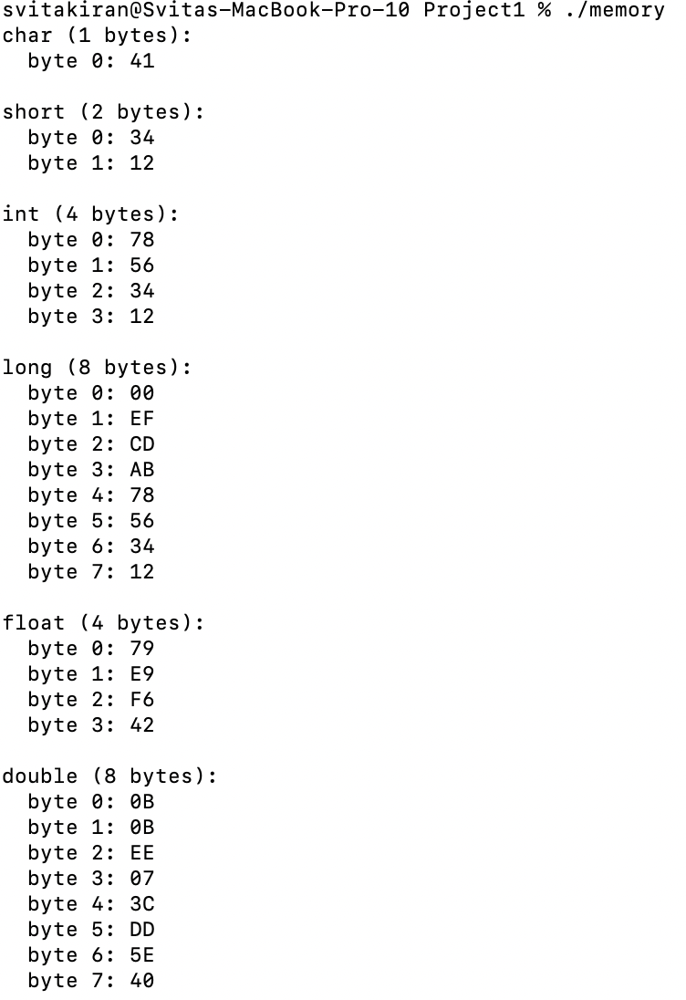
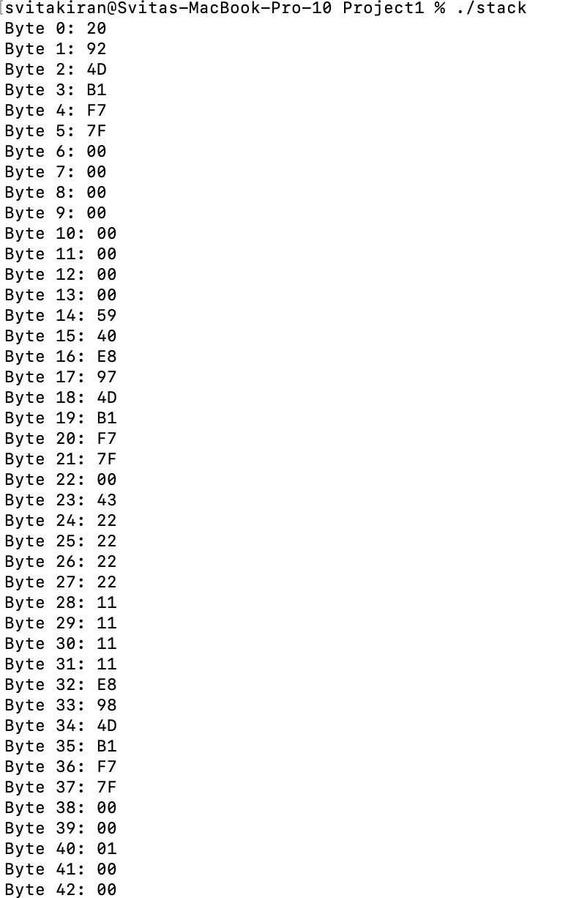
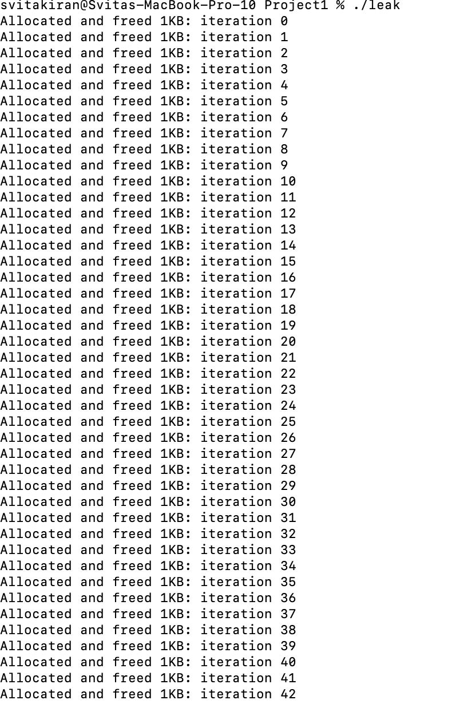
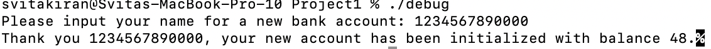

# CS333 - Project #1 - README
### Svita Kiran
### 09/18/2025

***Google Sites Report: https://sites.google.com/colby.edu/svitas-cs333/home/project-1 ***

## Directory Layout:
```
proj01/
|
|__/C/
|  |
|  |__/memory.c
|  |__/stack.c
|  |__/leak.c
|  |__/struct.c
|  |__/debug.c
|__/images/
|  |
|__|__|ctask1.png
|__|__|ctask2.png
|__|__|ctask3.png
|__|__|ctask5.png
```
## OS and C compiler
OS: OSX Ventura 13.6.7 
C compiler: Apple clang version 15.0.0 (clang-1500.0.40.1)

## Part I 
### task 1
**Compile:** $ gcc -o memory memory.c

**Run:** $ ./memory

**Output:**


**Q.b.** 

The machine is little endian

**Q.c.** 

I know this by looking at the output because the least significant byte will be stored at the lowest memory address. A big endian machine would have the opposite where the most significant bit comes first.
 
###task 2
**Compile:** $ gcc -o stack stack.c

**Run:** $ ./stack

**Output:**


**Q.b.** 

The overall layout seems to be downward in memory where every new variable is being stored at a lower memory address than the previous one.

**Q. c.**

Yes they are probably from previous saved registers or the current function's return address.

**Q. d.**

I can find the defined variables by matching the known assigned values to the pattern in the bytes.


###task 3
**Compile:** $ gcc -o leak leak.c

**Run:** $ ./leak

**Output:**


**Q.b.** 

Without free, there will be a memory leak since the RAM will keep getting consumed and it will be difficult to allocate new memory. With free, each memory allocation will get freed right away, preventing memory buildup. 

###task 4
**Compile:** $ gcc -o struct struct.c

**Run:** $ ./struct

**Q.a.**

Yes because once there is padding the results end up matching the observed.

**Q.b.** 

There are gaps because these come from the char variables and help align the next variable on the boundary.

###task 5
**Compile:** $ gcc -o debug debug.c

**Run:** $ ./debug

**Q.a.**

The string I found that doesn't work is 1234567890000.

**Q.b.** 



**Q. c.**

What went wrong is that char name is a fixed array of 10. If you input more values than that, the input overflows and goes into balance, so the output will end up printing a value instead of 0 even though that is what it was meant to be initialized as.