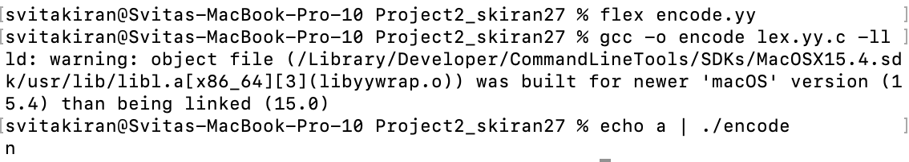
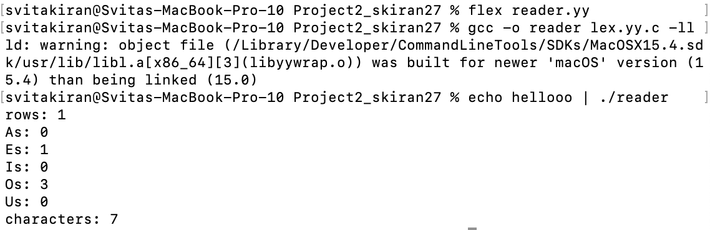
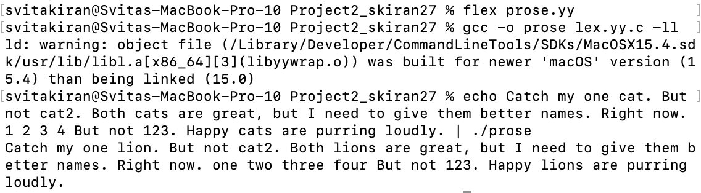
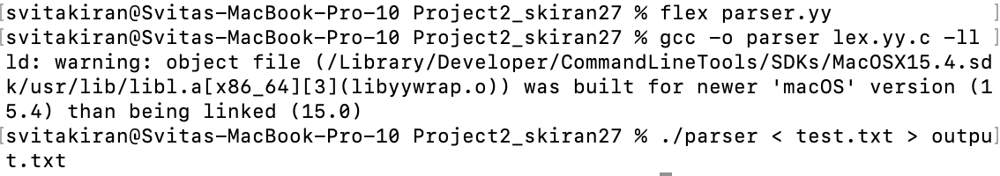
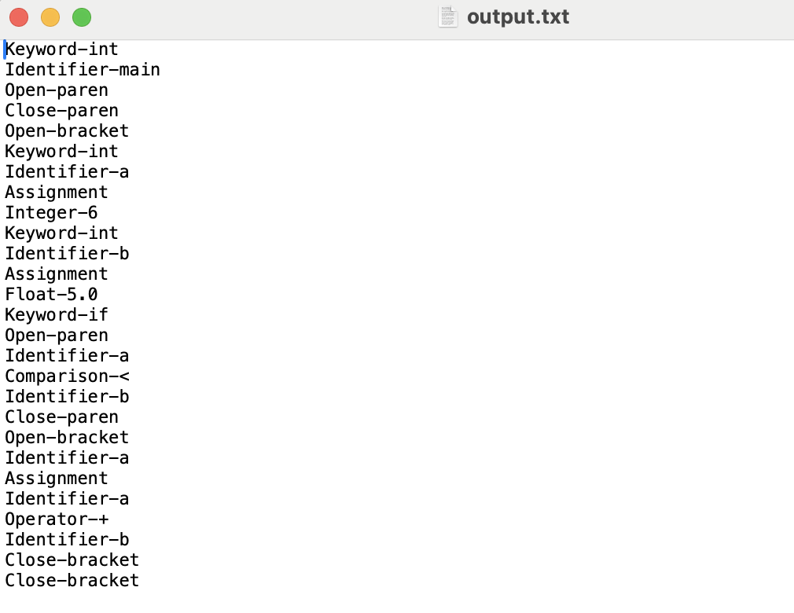

# CS333 - Project #2 - README
### Svita Kiran
### 10/02/2025

***Google Sites Report: https://sites.google.com/colby.edu/svitas-cs333/home ***

## Directory Layout:
```
Project2_skiran27/
|
|__/C/
|  |
|  |__/task1.c
|  |__/task2.c
|  |__/task3.c
|  |__/task4.c
|__/Go/
|__|
|__|__/helloworld.go
|__/Haskell/
|__|
|__|__/helloworld.hs
|__/images/
|  |
|__|__|ctask1.png
|__|__|ctask2.png
|__|__|ctask3.png
|__|__|ctask4.png
```
## OS and C compiler
OS: OSX Ventura 13.6.7 
C compiler: Apple clang version 15.0.0 (clang-1500.0.40.1)

## Part I 
### task 1
**Compile:** 
$ flex encode.yy 
$ gcc -o encode lex.yy.c -ll

**Run:** $ echo a | ./encode

**Output:**


**Q.b.** 

I chose 'a' as my letter and my code is able to shift it because it converts it to its ASCII value, then adds 13, and then wraps around the alphabet using a modulo of 26. 
 
### task 2
**Compile:** $ flex reader.yy
$ gcc -o reader lex.yy.c -ll

**Run:** $ echo hellooo |./reader

**Output:**

You can see in the output that all the numbers of characters and each vowel match exactly with the input given.

**Q.b.** 

The code is reading the number of rows, characters, and number of times each vowel appears in the tect input. 

### task 3
**Compile:** $ flex prose.yy $ gcc -o prose lex.yy.c -ll

**Run:** $ echo Catch my one cat. But not cat2. Both cats are great, but I need to give them better names. Right now. 1 2 3 4 But not 123. Happy cats are purring loudly. | ./prose

**Output:**


**Q.b.**

I tokenized entire words and compared exact tokens instead of substrings so that I could avoid partial replacements inside of longer words like Catch turning into lionch.

### task 4
**Compile:** $ flex parser.yy $ gcc -o parser lex.yy.c -ll

**Run:** $ ./parser < test.txt > output.txt

**Output:**



**Q.b.**

The flex code works by tokenizing the program by matching keywords, numbers, operators, etc, and each match prints a labeled string. One example is 5.0, which matches the rule {DIGIT}+"."{DIGIT}+   { printf("Float-%s\n", yytext); }, and prints Float-5.0.