# CS333 - Project #3 - README
### Svita Kiran
### 10/16/2025

***Google Sites Report: https://sites.google.com/colby.edu/svitas-cs333/home ***

## Directory Layout:
```
proj03/
|
|__/C/
|  |
|  |__/task1.c
|  |__/task2.c
|  |__/task3.c
|  |__/task4.c
|  |__/task5.c
|  |__/task6.c
|__/Go/
|  |
|  |__/task1.go
|  |__/task2.go
|  |__/task3.go
|  |__/task4.go
|  |__/task5.go
|__/images/
|  |
|__|__|ctask3.png
|__|__|ctask4.MOV
|__|__|ctask51.png
|__|__|ctask52.png
|__|__|ctask6.png
|__|__|ctask62.png
|__|__|ctask63.png
|__|__|gotask1.png
|__|__|gotask2.png
|__|__|gotask3.png
|__|__|gotask4.png
|__|__|gotask5.png
```
## OS and C compiler
OS: OSX Ventura 13.6.7 
C compiler: Apple clang version 15.0.0 (clang-1500.0.40.1)

## Part I 
### task 1

Creating cstk.h
 
### task 2

Creating cstk.c and implementing the methods from the cstk.h file.

### task 3
**Compile** $ gcc -o cstktest cstktest.c cstk.c

**Run:** $ ./cstktest

**Output:**
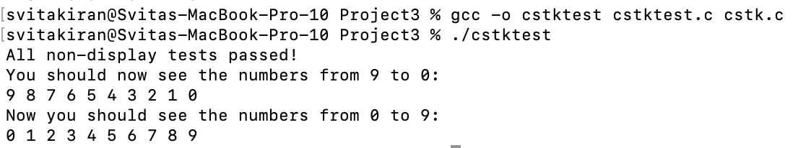

### task 4


### task 5

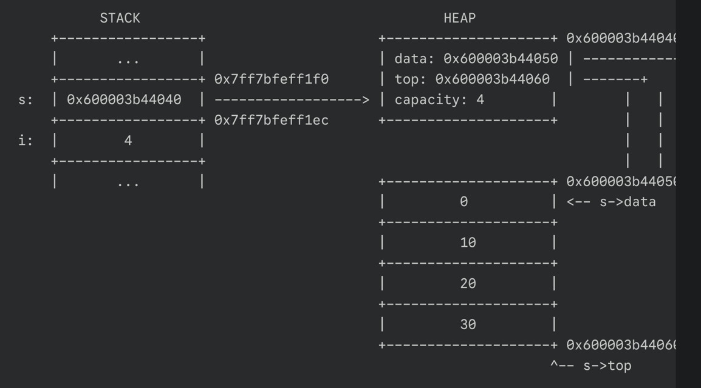
This is for mark 1. 2 allocations have occurred at the heap so far. First, stk_create allocated memory for the Stack structure itself. Second, it allocated a block of memory for the integer array that holds the stack's data. On the program's main stack frame, the local pointer s stores the heap address of the Stack struct. After the for loop, four integers have been pushed. The s->top pointer now points to the memory location immediately after the last element, which is s->data + 4. The loop variable i on the main stack has the value 4.

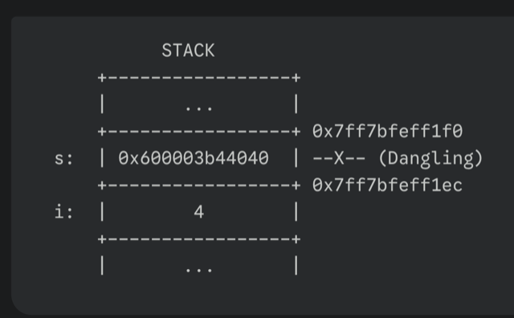
This is for mark 2. The heap doesn't show up since it now deallocated.
The stk_destroy(s) function has been called. Inside stk_destroy, free(s->data) was called first, deallocating the integer array on the heap. Then, free(s) was called, deallocating the Stack structure itself. The memory regions on the heap are now returned to the system and are considered invalid. The pointer s on the main stack still holds the old address, but it is now a dangling pointer. Attempting to dereference it would result in undefined behavior.

### task 6
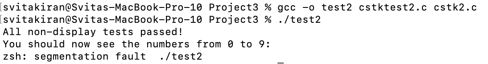
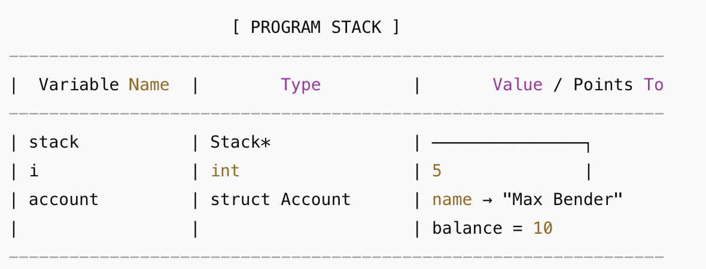
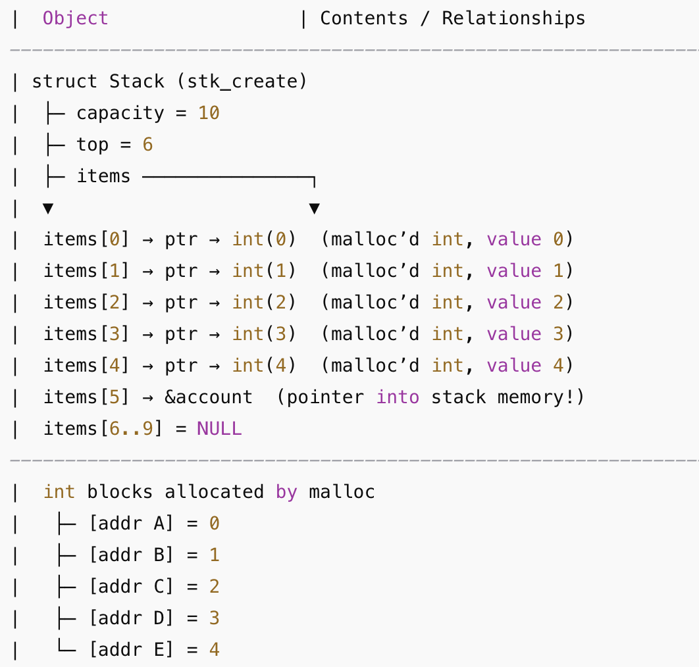

## Part II - Go
### task 1 
**Run:** $ go run task1.go

**Output:**
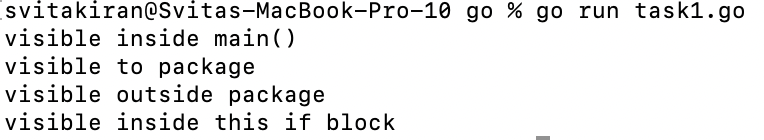

### task 2

**Run:** $ go run task2.go

**Output:**
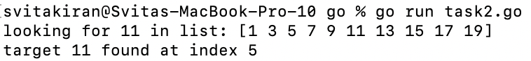

### task 3

**Run:** $ go run task3.go

**Output:**
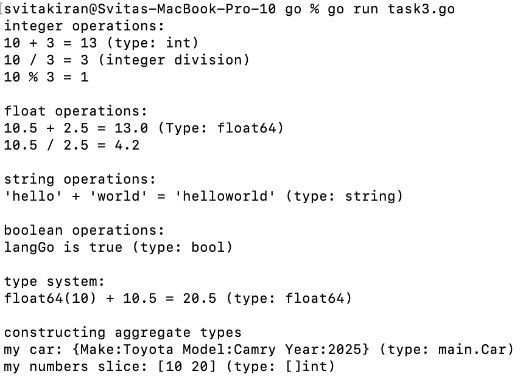

### task 4

**Run:** $ go run task4.go

**Output:**
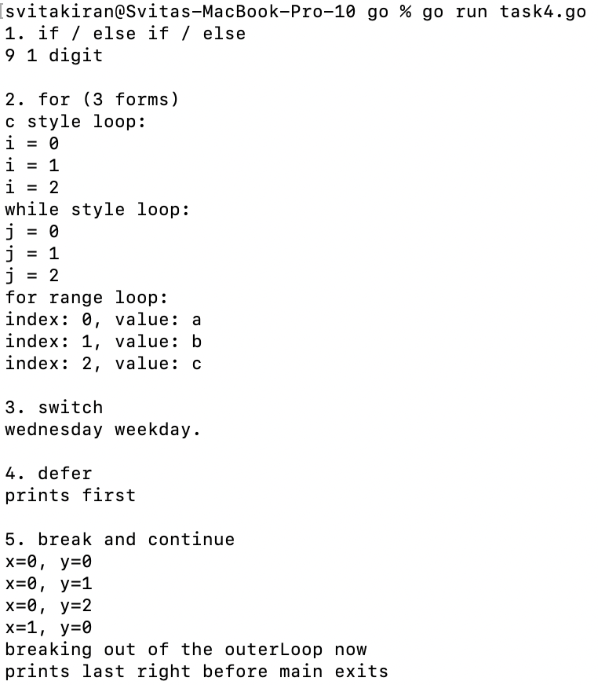

### task 5

**Run:** $ go run task5.go

**Output:**
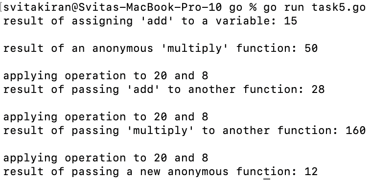