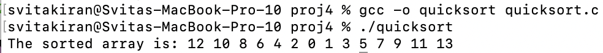
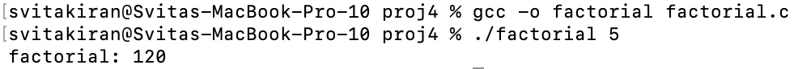
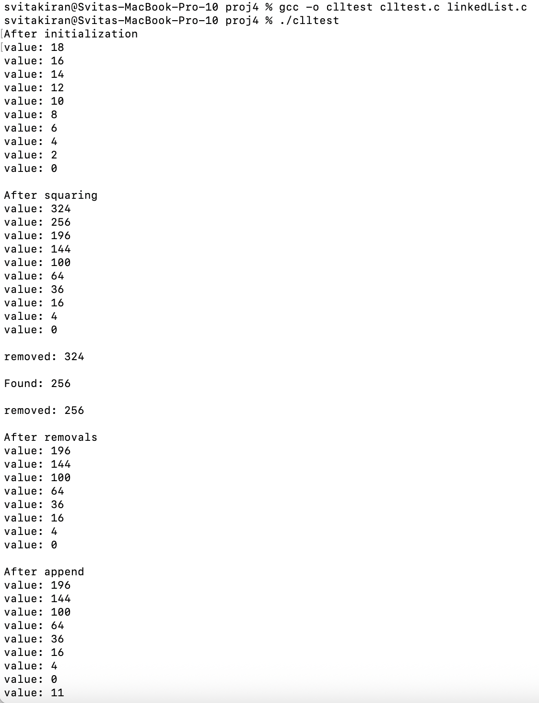
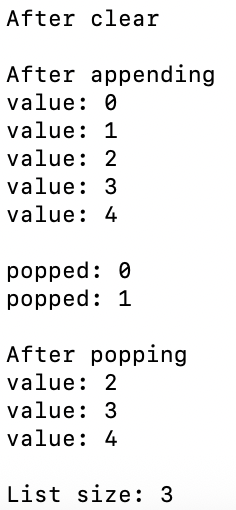
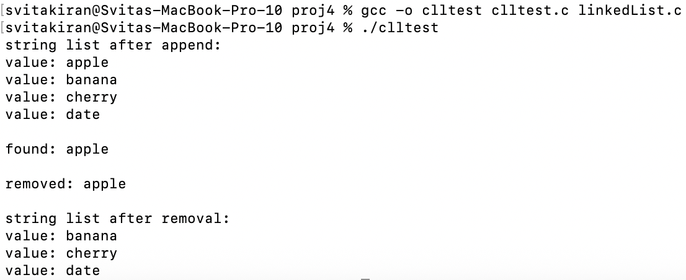
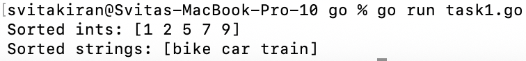
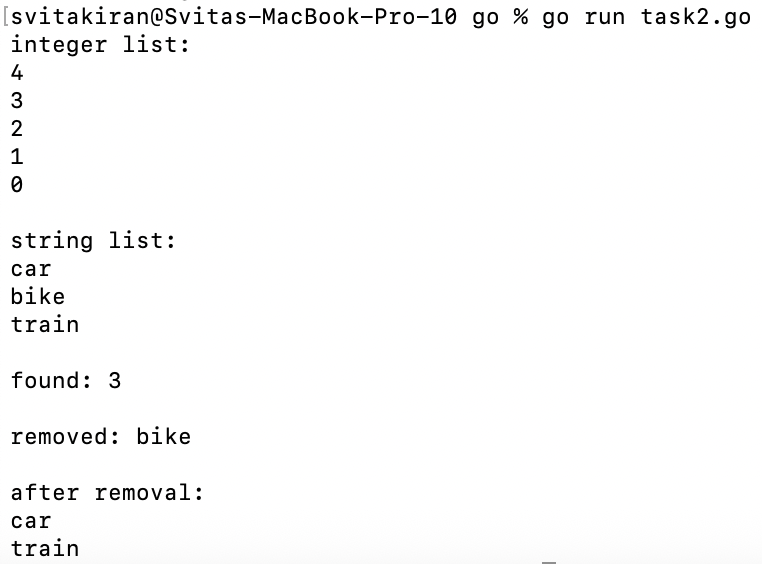
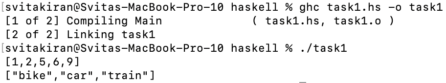
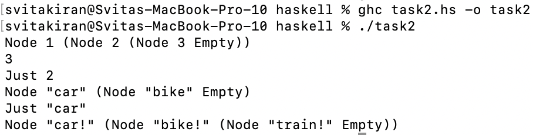

# CS333 - Project #4 - README
### Svita Kiran
### 10/30/2025

***Google Sites Report: https://sites.google.com/colby.edu/svitas-cs333/home ***

## Directory Layout:
```
proj04/
|
|__/C/
|  |
|  |__/quicksort.c
|  |__/factorial.c
|  |__/linkedList.c
|  |__/linkedList.h
|  |__/clltest.c
|__/Go/
|  |
|  |__/task1.go
|  |__/task2.go
|__/Haskell/
|  |
|__|__/task1.hs
|__|__/task2.hs
|__/images/
|  |
|__|__|ctask1.png
|__|__|ctask2.png
|__|__|ctask311.png
|__|__|ctask312.png
|__|__|ctask32.png
|__|__|gotask1.png
|__|__|gotask2.png
|__|__|hstask1.png
|__|__|hstask2.png
```
## OS and C compiler
OS: OSX Ventura 13.6.7 
C compiler: Apple clang version 15.0.0 (clang-1500.0.40.1)

## Part I 
### task 1
**Compile:** $ gcc -o quicksort quicksort.c

**Run:** $ ./quicksort

**Output:**


**Q.b.** 

I implemented the comparator function so that even numbers would come first by checking with %2, then sorted in descending order (return b - a), then odd numbers being sorted in ascending order (return a - b), and I have another if statement that makes sure that all even numbers will appear in the list before odd numbers do. 
 
### task 2
**Compile:** $ gcc -o factorial factorial.c

**Run:** $ ./factorial

**Q.a.** 

This demonstrates that functions in C can have addresses that can be stored in variables or passed as arguments. By declaring 'int (*calc)(const int)' and assigning it to 'factorial', I could see how the function's return and parameter types could be referenced and called through a pointer, like how other data types can be.

**Q. b.**



When I go from 12! up to 15!, the results change drastically. 12! gives me a correct result since the answer (479001600) still fits within a 32 bit signed int. Then 13!, 14!, and 15! get much larger and are greater than the limit that a 32 bit has so they end giving the wrong answers. 

### task 3
**Compile:** $ gcc -o clltest clltest.c yourLinkedList.c

**Run:** $ ./clltest

**Output for original data type:**



**Output for second data type:**


**Q. a.**

'freefunc' is a necessary parameter for ll_clear function because the linked list stores generic data pointers and the ll_clear function doesn't know how to free memory for the data on its own. If we didn't have 'freefunc' then only the nodes would end up getting freed which would cause a memory leak. 

An example where there would be a memory leak is if you made nodes that were dynamically allocated but then only freed the nodes (since you didn't use freefunc) but not the data inside of them, so the memory would still be allocated, causing a memory leak.

## Part II - Go 
### task 1 
**Run:** $ go run task1.go

**Output:**


### task 2
**Run:** $ go run task2.go

**Output:**


### task 3

on google sites

## Extensions
### extension 1
**Description**
Implementing a general quick sort algorithm that can be used for any type and used to obtain any desired order with haskell.

**Compile:** $ ghc task1.hs -o task1

**Run:** $ ./task1

**Output:**


### extension 2
**Description** 
Implementing a LinkedList class with haskell making use of polymorphism to implement the data structure. 

**Compile:** $ ghc task2.hs -o task2

**Run:** $ ./task2

**Output:**


### extension 3
**Description:**

on google sites

