# CS333 - Project #5 - README
### Svita Kiran
### 11/13/2025

***Google Sites Report: https://sites.google.com/colby.edu/svitas-cs333/home ***

## Directory Layout:
```
proj05/
|
|__/C/
|  |
|  |__/task1a.c
|  |__/task1b.c
|  |__/task1c.c
|  |__/task2.c
|  |__/task3.c
|  |__/detect_garbage.c
|  |__/linkedList.h
|  |__/linkedList.c
|__/Go/
|  |
|  |__/task1.go
|  |__/task2.go
|  |__/task3.go
|  |__/task4.go
|  |__/task5.go
|__/Haskell/
|  |
|__|__/task1.hs
|__|__/task2.hs
|__|__/task3.hs
|__|__/task4.hs
|__|__/task5.hs
|__/images/
|  |
|__|__|ctask1a.png
|__|__|ctask1b.png
|__|__|ctask1c.png
|__|__|ctask2.png
|__|__|ctask31.png
|__|__|ctask32.png
|__|__|ctask41.png
|__|__|ctask42.jpg
|__|__|gotask3.png
|__|__|gotask5.png
|__|__|hstask3.png
|__|__|hstask5.png
```
## OS and C compiler
OS: OSX Ventura 13.6.7 
C compiler: Apple clang version 15.0.0 (clang-1500.0.40.1)

## Part I 
### task 1
**Compile:** $ gcc -o task1a task1a.c

**Run:** $ ./task1a

**Output:**
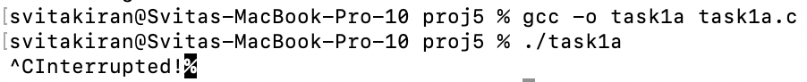

**Q.b.** 
**Compile:** $ gcc -o task1b task1b.c

**Run:** $ ./task1b

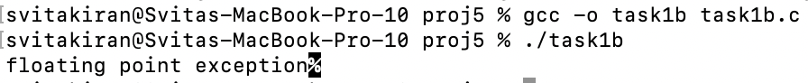

**Q.c.**
**Compile:** $ gcc -o task1c task1c.c

**Run:** $ ./task1c

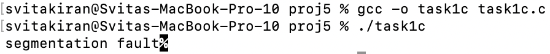
 
### task 2
**Compile:** $ gcc -o task2 task2.c

**Run:** $ ./task2 wctest.txt

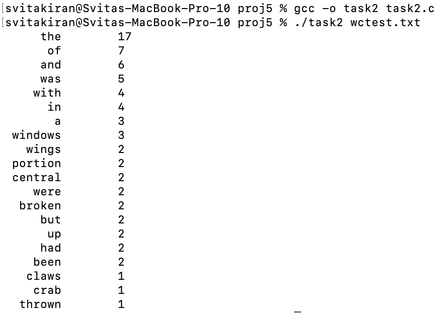

**Q.a.** 

I implemented the requirements by first reading each word from the file and passing it through a 'clean_word' function that removed any leading or trailing punctuation, and then converted the word to lowercase with a 'to_lower' function to make everything lowercase. Each word was then searched in the linked list using 'll_find', and if it existed, its count was incremented, otherwise a new Word struct was allocated and appended to the list with 'll_append'. The filename was read from the command line by accessing argv[1] and opening it with 'fopen'. After processing all words, I copied the linked list into an array, sorted the array by the count field in descending order, and printed the top 20 most frequent words.

### task 3
**Compile:** $ gcc -o task3 task3.c

**Run:** $ ./task3

**Output:**
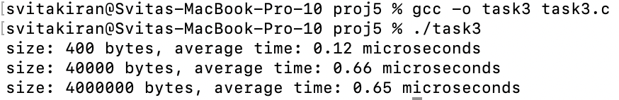

**Graph:**
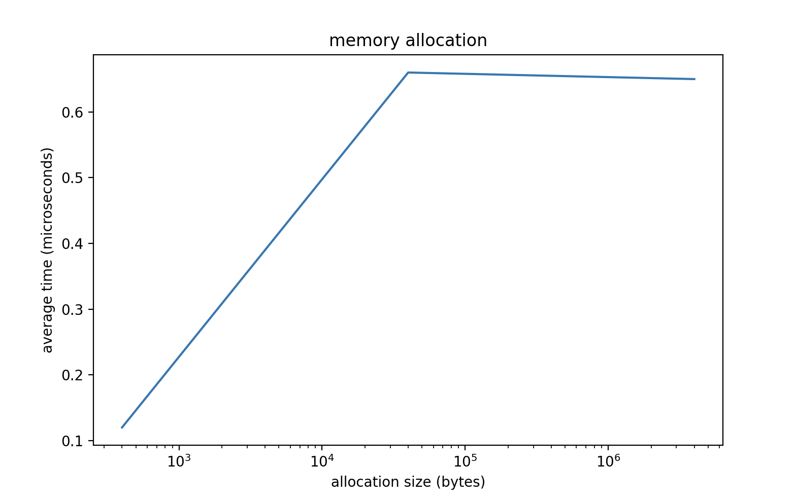

**Q. a.**

From the graph, we can see that the allocation time increases slightly from small to medium blocks but then remains almost constant for the large blocks. This suggests that for very large allocations, the overhead per malloc call becomes negligible compared to the size being allocated. Overall, it is more efficient to allocate all the bytes at once rather than in many smaller chunks, because each malloc call has some fixed overhead, and combining the allocation into a single larger block avoids repeating that overhead multiple times.

### task 4
**Compile:** $ gcc -o task4 detect_garbage.c

**Run:** $ ./task4

**Output:**
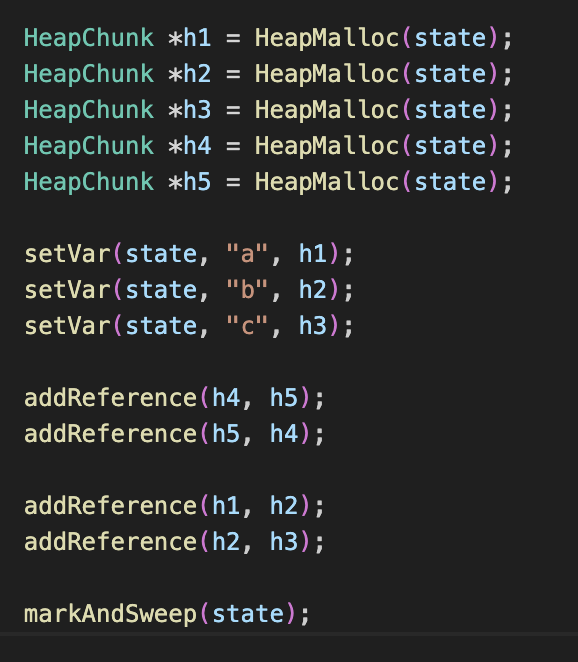
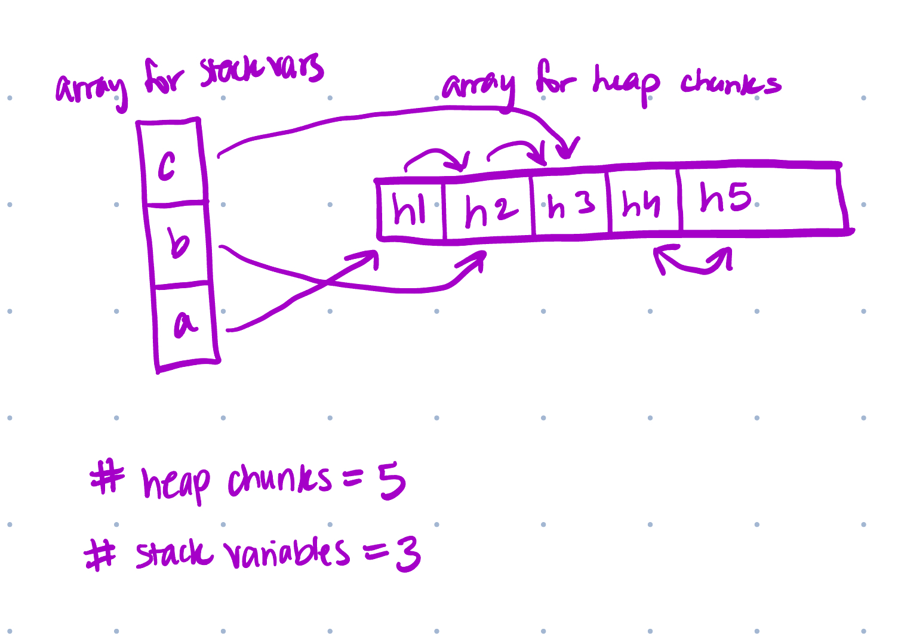

## Part II - Go 
### task 1 
on google sites

### task 2
on google sites

### task 3
**Run:** $ go run task3.go wctest.txt

**Output:**
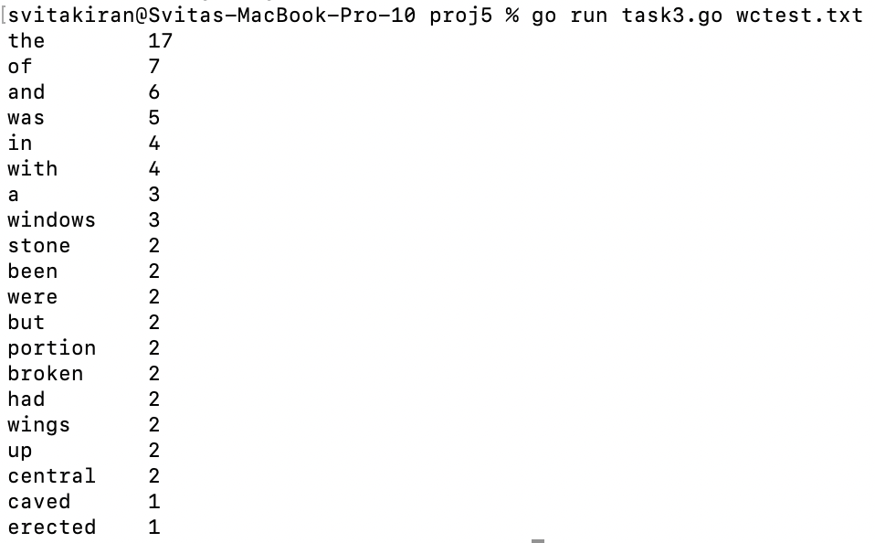

### task 4
on google sites

### task 5
**Run:** $ go run task5.go

**Output:**
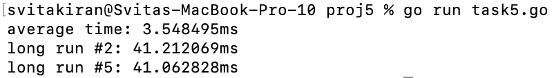


## Extensions
### extension 1
**Description**
Doing Part II of the project for Haskell: task1 

on google sites

### extension 2
**Description** 
Doing Part II of the project for Haskell: task2

on google sites

### extension 3
**Description:**
Doing Part II of the project for Haskell: task3

**Compile:** $ ghc task3.hs -o task3

**Run:** $ ./task3 wctest.txt

**Output:**
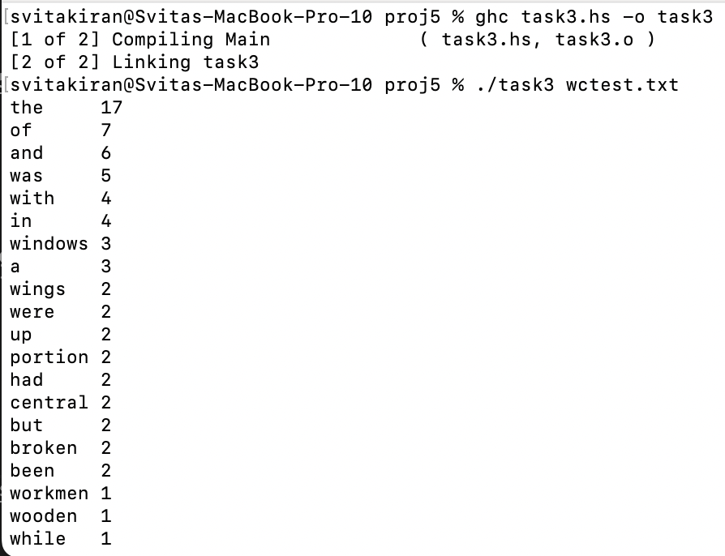

### extension 4
**Description:**
Doing Part II of the project for Haskell: task4

on google sites

### extension 5
**Description:**
Doing Part II of the project for Haskell: task5

**Compile:** $ ghc task5.hs -o task5

**Run:** $ ./task5

**Output:**
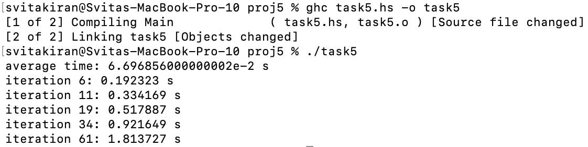