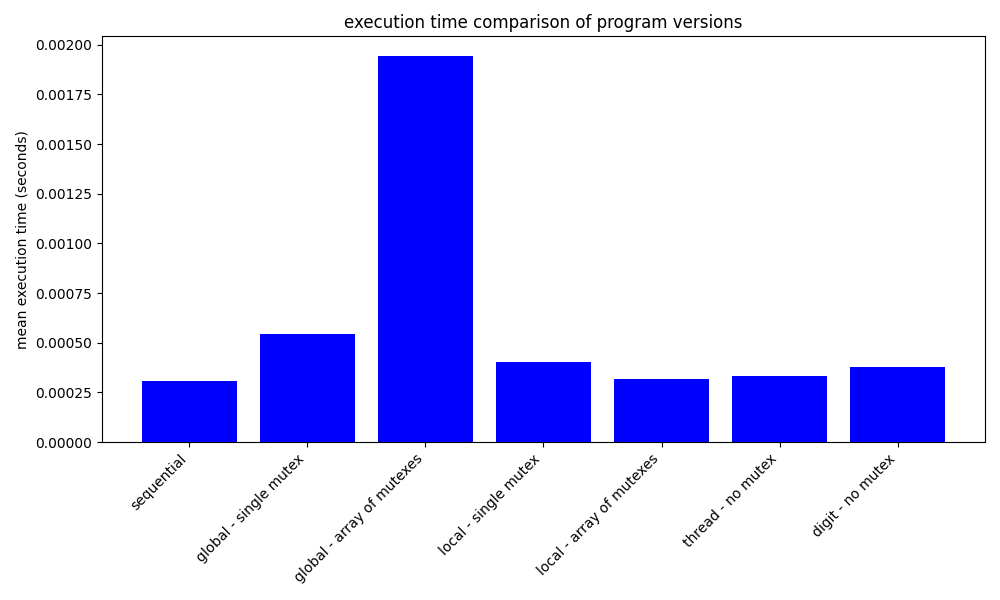
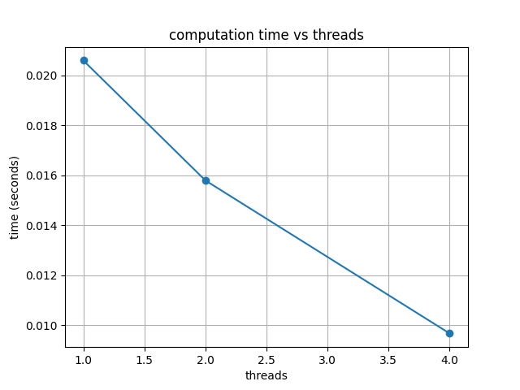
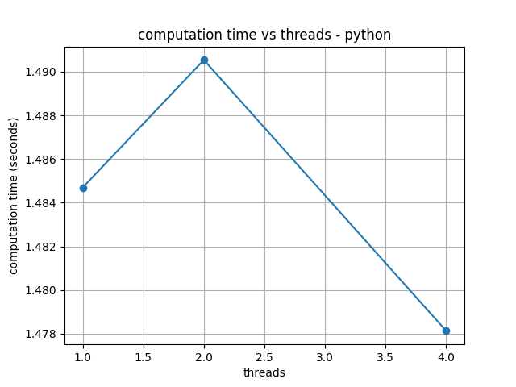
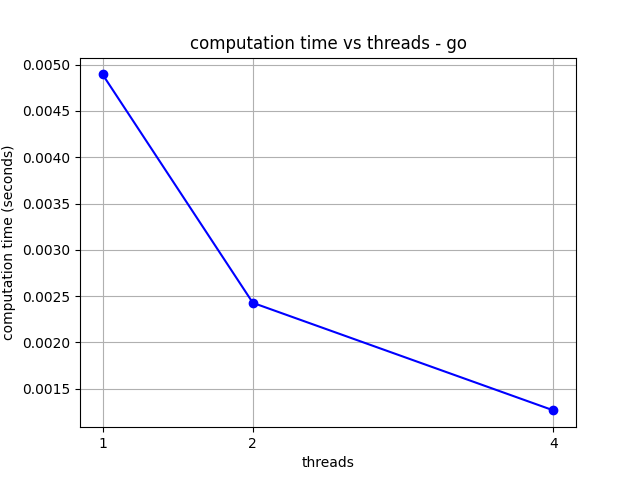
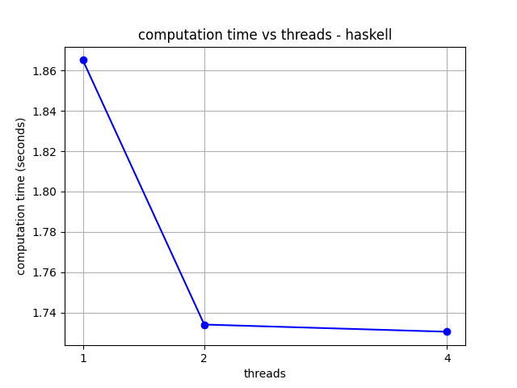

# CS333 - Project #6 - README
### Svita Kiran
### 12/4/2025

***Google Sites Report: https://sites.google.com/colby.edu/svitas-cs333/home ***

## Directory Layout:
```
proj05/
|
|__/C/
|  |
|  |__/benford_sequential.c
|  |__/benford_par.c
|  |__/my_timing.c
|  |__/my_timing.h
|  |__/colorize.c
|  |__/ppmIO.c
|  |__/ppmIO.h
|__/Python/
|  |
|  |__/pyppmIO.py
|  |__/graph.py
|__/Go/
|  |
|  |__/gocolorize.go
|__/Haskell/
|  |
|__|__/hscolorize.hs
|__/images/
|  |
|__|__|IMG_4203.ppm
|__|__|ctask2.png
|__|__|pt2task2.png
|__|__|gotask2.png
|__|__|hstask2.png
```
## OS and C compiler
OS: OSX Ventura 13.6.7 
C compiler: Apple clang version 15.0.0 (clang-1500.0.40.1)

## Part I 
### task 1
**Compile:** $ gcc -o benford_par my_timing.c benford_par.c -lm -lpthread

**Run:** $ ./benford_par medium.bin

**Output:**


The sequential version of the program takes about 0.00031 seconds to run and is the baseline. The parallel version using a single global mutex is slower because all threads have to wait to access the shared counter. Using an array of mutexes per digit is even slower, most likely because the threads spend more time locking and unlocking. The local counters are much faster since threads don’t compete as much. The fastest is the local counters with per digit mutexes. The versions that don’t use any mutexes also run quickly because there is no waiting for locks. Overall, using local counters or avoiding locks helps the program run faster.

**Q.a.** 

The sequential version is already very fast for this dataset, but adding a single global mutex actually makes the program slower because all threads compete for the same lock. Versions that reduce locking, such as using one mutex per digit, improve performance, but still pay some cost. The fastest approaches count locally in each thread and only update shared data at the end. Parallelization seems to only help when synchronization overhead is low, and locking often makes the program slower.

**Q.b.**

Mutexes are used to keep threads from updating the same memory at the same time. Without them, increments from different threads can overwrite each other and give incorrect benford counts. In this problem, each protected operation is just a tiny integer increment, so the cost of locking and unlocking a mutex can be more than the actual work itself, which makes those versions slow. A better approach is to give each thread its own local counters so they wouldn't need to lock in the inner loop. Then, a quick final merge by a single thread would produce the final result with little to no locking.

**Q.c.**

Mutexes are useful when threads need to safely read and write the same shared data structure and those updates need to happen without being split among threads. They are also needed when you can’t redesign the program so that each thread works on its own data, such as when threads need to frequently communicate or depend on each other’s updates. Mutexes make sense when the work inside the critical section is heavy or happens only occasionally, because that is when the cost of locking is small.

 
### task 2
**Compile:** $ gcc -o colorize -I. colorize.c ppmIO.c my_timing.c -lpthread -lm

**Run:** $ ./colorize IMG_4203.ppm 1



**Q.a.** 

The program can run with 1, 2, or 4 threads while the single thread version just processes all pixels in order. Shown in the graph, it took about 0.0206 seconds with 1 thread, 0.0158 seconds with 2 threads, and 0.0097 seconds with 4 threads, showing that using more threads makes it faster. This shows how parallel processing speeds up the program.

## Part II - Go 
### task 1 
on google sites

### task 2
**Run:** $ python3 pyppmIO.py IMG_4203.ppm 1

**Output:**


**Q.a.**

Using 1, 2, and 4 threads, the computation times were all around 1.47 seconds, and adding threads didn’t make it any faster. This is because python’s Global Interpreter Lock (GIL) doesn't allow parallel execution with threads. The graph of computation time versus threads shows that performance stays around the same even after changing the thread count. There seems to be a large spike but that it just because the y-axis is very zoomed in so small changes seem sensitive, however looking at the numbers you would be able to tell that there is actually little difference. 

## Extensions
### extension 1
**Description**
Doing Part II of the project for Haskell: task1 

on google sites

### extension 2
**Description** 
Doing Part II of the project for Go: task2

**Run:** $ 

**Output:**


**Q.a.**

Go supports parallelism through concurrent threads managed by the Go runtime. In the code,  the image split into chunks and each one was assigned to a separate goroutine, waiting for all of them to finish before measuring the time. The results show that adding threads reduces computation time, which you can see in the graph, with 0.004895 seconds for 1 thread, 0.002427 seconds for 2 threads, and 0.001265 seconds for 4 threads. This shows how Go’s parallelism causes faster image processing.

### extension 3
**Description:**
Doing Part II of the project for Haskell: task2

**Run:** $ runhaskell hscolorize.hs IMG_4203.ppm 4

**Output:**


**Q.a.**

Haskell supports parallelization using threads, so it can run computations concurrently. With this code, I split the image into chunks and processed each chunk in a separate thread. However, the timing results show that adding threads barely reduced computation time, with 1.865 seconds for 1 thread, 1.734 seconds for 2 threads, and 1.730 seconds for 4 threads. This suggests that for this small image the overhead of creating and managing threads offsets most of the benefits. Parallelism could still make haskell faster for larger images or more complex computations.